# Docker

## 1) 개요
- 아커스는 리눅스 기반의 프로젝트로 윈도우에서 돌아가지 않음 
- 윈도우 환경에서 도커 툴박스를 사용하여 아커스 컨테이너 구동.

----

## 2) 이슈 및 해결
 - 포트 포워딩
  - [윈도우와 도커 컨테이너의 기본적인 구조]
     - 윈도우 … VM WARE (192.168.99.100) … 도커 (172.17.x.x)
     - 따라서 , 윈도우와 VM WARE, VM WARE와 도커의 포트를 포워딩해야 윈도우 클라이언트가 도커에 직접 연결 가능
  - [윈도우 … VM WARE]
     - VM WARE 설정
     - 네트워크
     - 포트 포워딩 ( 2181, 11211, 11212 ) 
  - [VM WARE … DOCKER]
     - Docker run –p 2181:2181 –p 11211:11211 –p 11212:11212 설정

----

# Arcus(vs RDBMS)

## 1) 개요
 - RDBMS와 RDMBS+ARCUS 성능 비교

----

## 2) 개발 환경
 - Eclipse JAVA Client
 - Docker Arcus ( zkAddr={127.0.0.1:2181), zkClient={127.0.0.1:11211, 127.0.0.1:11212 } )
 - mysql (world db)

----

## 3) 성능비교

- 질의 : 미국, 중국, 한국, 일본, 프랑스, 인도에서 인구수 백만을 넘는 도시
- sql query
  - SELECT * 
  - FROM city 
  - WHERE CountryCode in ("USA", "CHN", "KOR", "JPN", "FRA", "IND”) AND population >= 1000000;
- world DB에서 다음의 SQL 실행 속도 비교
- 이를 위해 아커스에서는 LIST, SET 자료구조를 사용
  - [SET]	
     - arcusClient.asyncSopInsert("city:" + rs.getString("countryCode"), rs.getInt("id"))
 - [LIST]
     - arcusClient.asyncLopInsert(rs.getString("countryCode") + ":" + rs.getInt("id"), 0,rs.getString("name"), attribute)
     - arcusClient.asyncLopInsert(rs.getString("countryCode") + ":" + rs.getInt("id"), 1, String.valueOf(rs.getInt("population")), attribute)

----

## 4) 성능비교 

 - 결과
   - RDBMS+Arcus : 7434ms
   - RDBMS only : 4ms
 
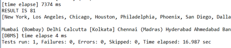

- 분석
  - 결과는 아커스의 참패였다.
  - 원인은 DB크기가 워낙 작아 ARCUS를 사용하는 오버헤드가 더 크기 때문이라 생각한다.

----

# Arcus Mult-Node

## 1) 개요
 - 아커스는 메모리 캐시 클라우드로서 한대의 컴퓨터가 아닌 여러 컴퓨터를 연결해야 성능이 제대로 발휘된다.

----

## 2) 구성
 - 리눅스 컴퓨터가 한 대 밖에 없고 도커는 ssh로 접속하면 host로 접속이 되므로 
 - 도커가 admin, 리눅스 원격 컴퓨터를 아커스 서버로 사용하였다.
 - 즉 , 도커(172.30.1.32) ……………. 원격호스트(172.30.1.28)

----

## 3) 세팅

    (1) ssh 
         $mkdir ~/.ssh 
         $chmod 700 ~/.ssh 
         $ssh-keygen –t rsa
         $ssh-copy-id [hostip]

----

    (2) arcus.sh
     zklist = “172.30.1.28:2181”
    
----

    (3) test.json

     { "hostname": "localhost", "ip": "172.30.1.28",
               "config": {
                   "threads"    : "6"
                 , "memlimit"   : "100"
                 , "port"       : "11211"
                 , "connections": "1000"
               }
             }
           , { "hostname": "localhost", "ip": "172.30.1.28",
               "config": {
                   "threads"    : "6"
                 , "memlimit"   : "100"
                 , "port"       : "11212"
                 , "connections": "1000"
               }
             }

----

 - 하지만 이렇게 해면 deploy가 되지 않는다

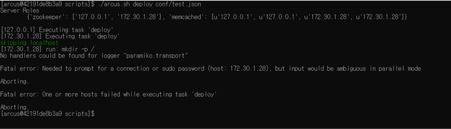

 - 아커스 파이썬 패키지 문제이다.
 - 이를 해결하기 위해 Fabric을 최신 버전으로 바꿔야 한다.
 - 그러기 위해 다음과 같이 build.sh 를 수정하였다.
 - Fabric==1.14.0 으로 고쳐줌으로써 fabric을 최신 버전으로 바꿔줘야 에러가 해결된다.

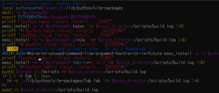

 - 그러면 다음과 같이  /arcus/lib/python/site-packages가 다음과 같이 바뀐다.

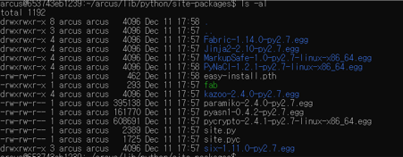

----

## 4) 실행

 - $./arcus quicksetup conf/test.json

 - [ 도커에서 ]
   - 도커는 172.30.1.32 host에서 돌아가고 memcached 서버는 172.30.1.28에서 돌아간다.

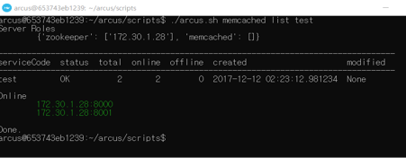
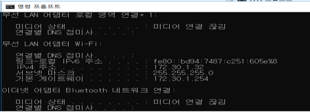

 - [원격호스트]

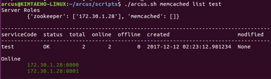

----

# Hubblemon

## 1) 개요
 - 허블몬은 python3 , django 기반의 범용 모니터링 관리도구이다. 현재 여러 클라이언트 플러그인을 제공하고 있다.
 - 우리팀은 아커스 , 맴케시 용 플러그인을 사용하여 모니터링을 실시했다.

----

## 2) 환경

 - os : linux(ubuntu 16.04)
 - apache2 server
 - arcus(+zookeeper,memcached)
 - hubblemon

----

## 3) 세팅

 - requirement
   - zookeeper server running
   - apache2 server running
 - dependency
   - python3 , pip3
   - django ~= 1.10
   - kazoo ~= 2.2.1
   - python-memcached ~= 1.57
   - redis ~= 2.10.5
   - pymysql 
   - psutil
   - rrdtool~=0.1.2
   
 - code modify(as official manual)
   - /hubblemon/common/setting.py
   - /hubblemon/collect_server/setting.py
   - /hubblemon/collect_client/run_client.py

----

## 4) 실행

 - 백그라운드 실행을 위해서 nohup 명령어 사용
   - $ cd hubblemon/ 
   - $ apache2 service start
   - $nohup python3 ./collect_server/run_server.py &
   - $nohup python3 ./collect_server/run_listener.py &
   - $nohup python3 ./collect_client/run_client.py &
   - $nohup python3 manage.py runserver 127.0.0.1:8080 &

----

## 5) 결과

 - firefox 에서 127.0.0.1:8080
 - 사진

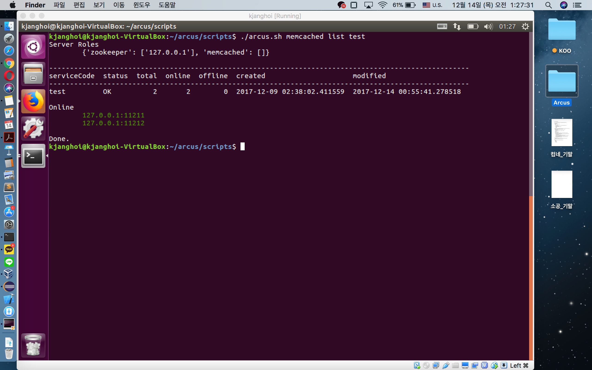
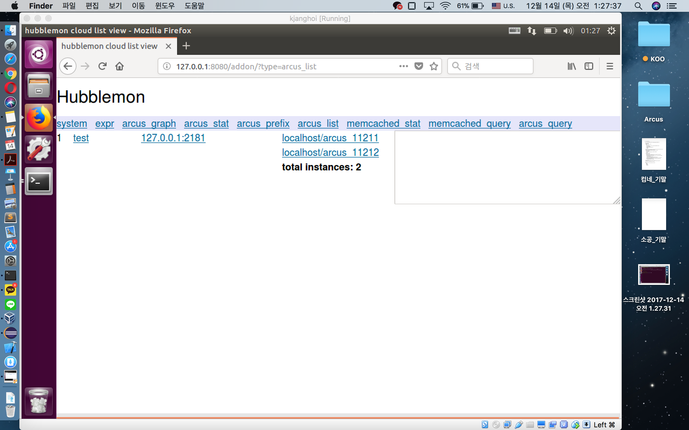

- 분석
   - local host의 zookeeper(port:2181)가 memcached(port : 11211 , 11212)와 연결 된 상태

----

# nBase-ARC

## 1) 개요 

 - 엔베이스 아크는 레디스 기반의 분산 저장 플랫폼이다. 
 - 클러스터를 사용하는데 이는 sync 하게 복제된 redis server group으로 구성되어 있다.
 - 우리 팀은 클러스터 1개를 사용했다.(PGS,GW 또한 로컬 환경에서 1개씩 구성했다.)

----

## 2) 환경

 - os : linux(ubuntu 16.04)
 - nbase-arc
 - zookeeper
 - fabric
 - maven

----

## 3) 세팅

 - requirement 
   - zookeeper server running

 - code modify
   - /nbase-arc/confmaster/cc.properties
      - confmaster.ip
      - confmaster.zookeeper.address
   - /nbase-arc/mgmt/config/conf_mnode.py
      - CONF_MASTER_IP
      - CONF_MASTER_PORT
      - CONF_MASTER_MGMT
      - USERNAME
   - /nbase-arc/mgmt/config/conf_dnode.py
      - REDIS_VERSION
      - GW_VERSION
      - SMR_VERSION
   - authorized_keys 배포
      - $ssh-keygen
      - $ cat $HOME/.ssh/id_rsa.pub >> $HOME/.ssh/authorized_keys
   - create cluster
      - $cd /nbase-arc/mgmt
      - $fab main
      - >> 14 
      - >> 4

-----

## 4) 실행

 - zookeeper run
   - arcus의 zookeeper를 그대로 사용
   - $./arcus/zookeeper/bin/zkServer.sh restart
- $cd team15/project/nbase-arc-java-client/
- $mvn test

----

## 5) 성능테스트

 - ‘2번의 아커스’ 와 같은 방식의 성능 테스트를 실행했다
 - 즉 , mysql world db에 대해 nbase-arc vs RDBMS(mysql) 테스트 했다.

 - 아커스의 성능 테스트와 마찬가지로 nbase-arc를 테스트 하기 위해 set , list 자료구조를 사용하였다. 
 - 다행히 nbase-arc가 redis 기반이여서 기존 redis의 set,list를 그대로 사용했다.

---

 - [nbase-arc cluster에 key-value의 쌍을 set,list에 저장하는 부분]

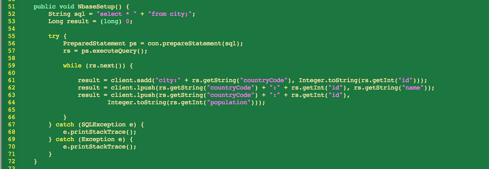

---

 - [nbase-arc cluster에 set,list에서 key-value의 쌍을  꺼내는 부분]

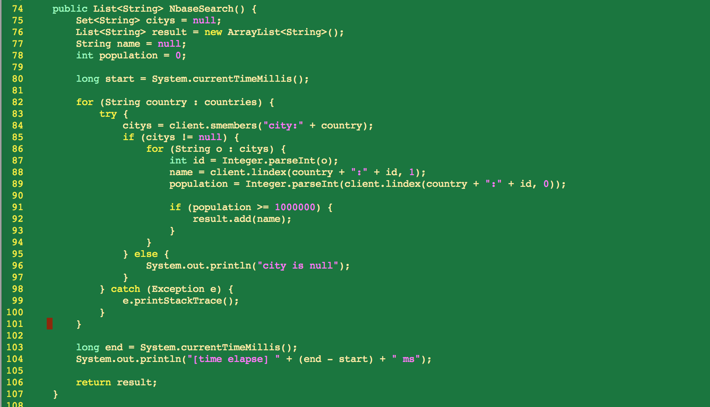

----

## 6) 결과

 - 결과
   - nBase-ARC : 805ms
   - RDBMS : 4ms

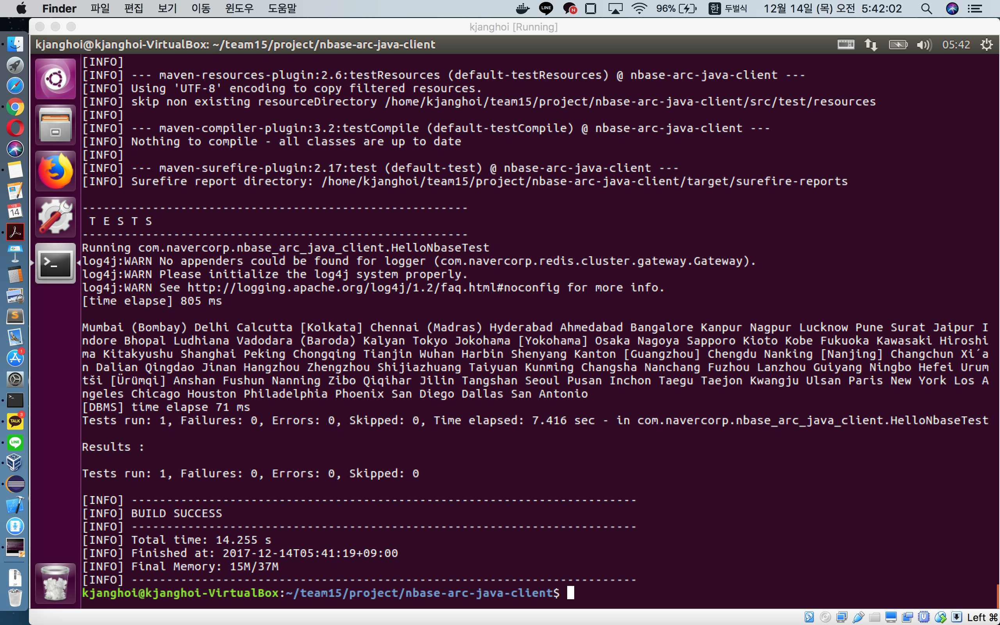

 - 분석
   - 결과는 nbase-arc 의 참패였다.
   - 원인은 DB크기가 워낙 작아 redis server에 저장하고 꺼내오는 오버헤드가 더 크기 때문이라 생각한다.

----

# nGrinder

## 1) 개요

 - nGrinder는 성능 측정 tool 이다.
 - arcus 성능 측정이 목적이였지만 실제로는 www.google.com 으로 테스트 하였다.

----

## 2) 설정

 - requirement
   - oracle-jdk , tomcat, jdk
   - nGrinder controller , agent , Target server

 - Target server  : www.google.com
 - controller : localhost:16001
 - agent : localhost:12000~12009

----

## 3) 실행

---

- install & run  nGrinder controller-3.4.war

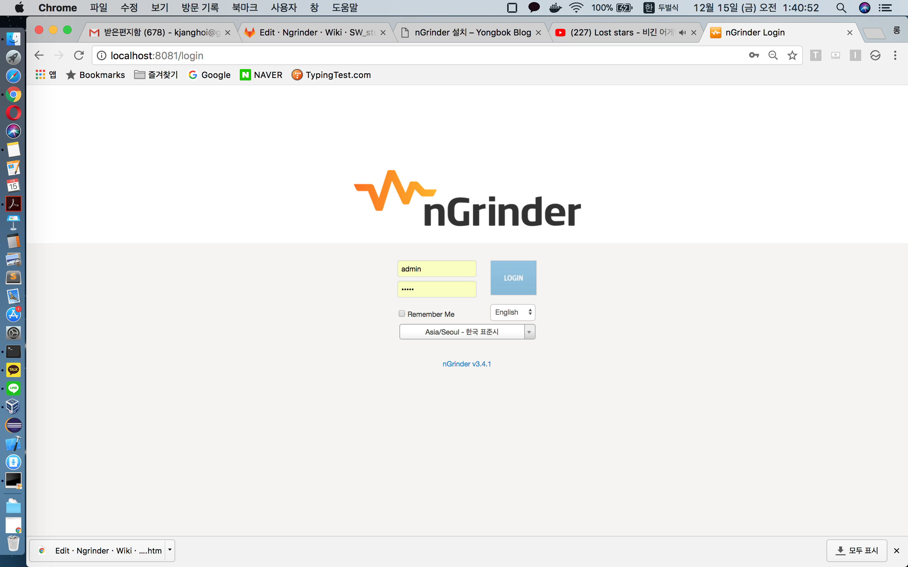

---

 - docker 환경에서 ngrinder-controller 컨테이너를 실행
   - 포트설정
      - -p 8081:80  
      - -p 16001:16001
      - -p 12000-12009:12000-12009

- docker 환경에서 ngrinder-agent 컨테이너를 실행

----

## 4) 설정

 - # of agent  = 1
 - # of vuser per agent = 3000
   - # of process = 10
   - # of thread = 300
 - duration = 2m

---

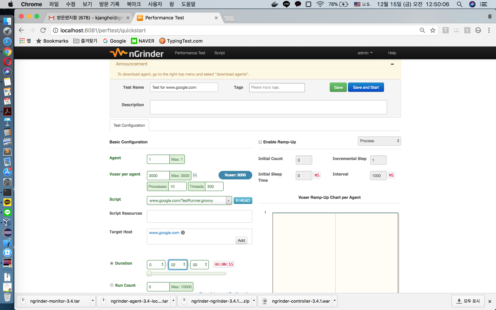

----

## 5) 결과

---

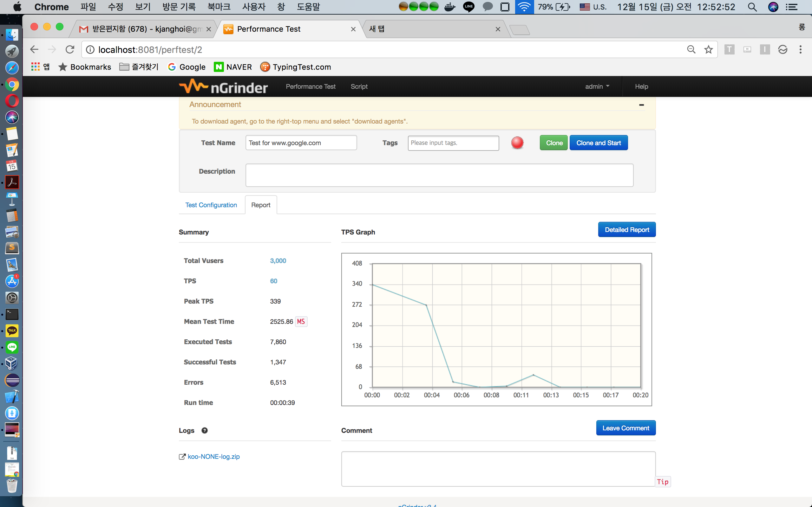

----

# Contribution

## 1) Arcus Multi-Node

 - 우분투 16 환경에서 python package ( fabric-1.8.3) 호환성 문제로 
 멀티노드를 구성하려고 IP에 127.0.0.1 이외의 것을 적으면 다음과 같은 오류가 발생

 
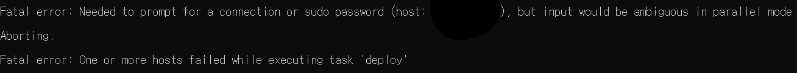

 
 - 해결방법:
1. 우분투 14환경에서 실행
2. 우분투 16환경

1) fab을 최신 버전으로 설치
 easy_install pip
 pip install --upgrade fab

2) 아커스내부 lib 갱신
 build.sh에서
 112줄의
 $pythonpath fabirc==1.8.3 을
 $pythonpath fabirc==1.14.0 로 바꿈
 
 위 해결 방법을 issue 및 pull request함

 - https://github.com/naver/arcus/issues/33
----

## 2) nBase-ARC

- 문제 사항
   - 메뉴얼의 세팅을 시행하고 cluster를 create 하는 과정에서 docker 환경과 linux 환경 모두 버젼 관련 에러가 있었다.
   - 교수님이 해결 후 이슈 등록을 할 것을 권유

---
   - docker 환경

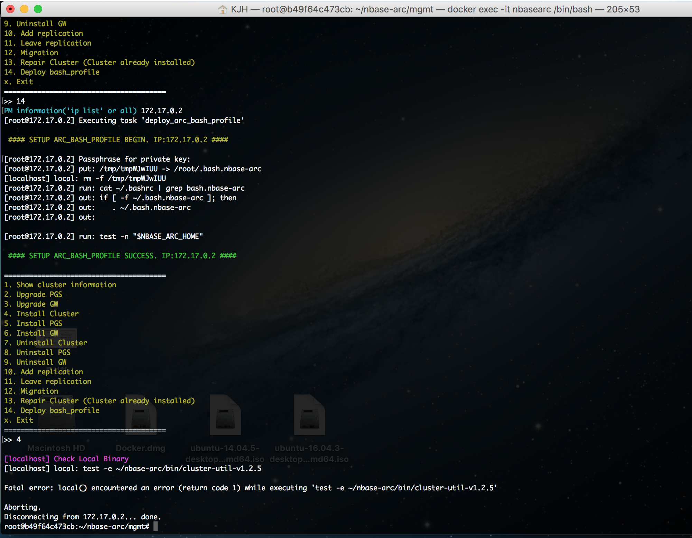

---
   - linux 환경
 
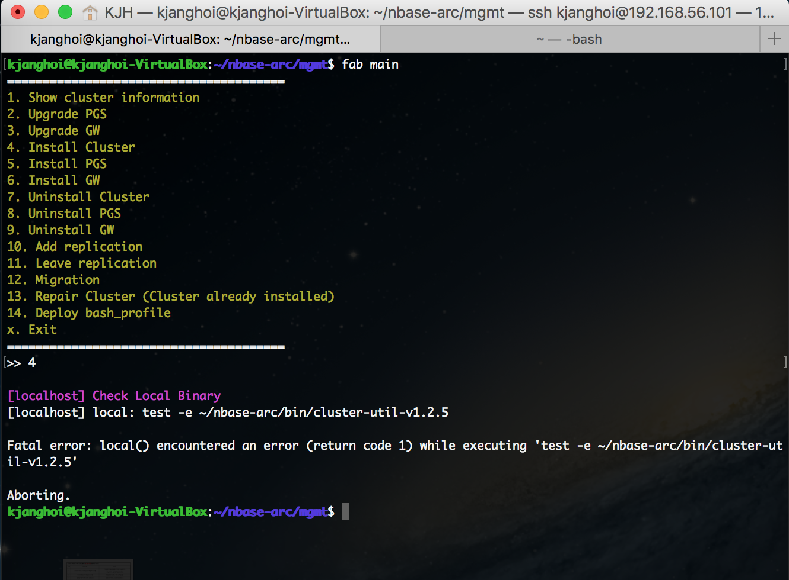

 - 해결과 이슈 등록
   - Hubblemon 디렉토리 아래의 여러 파일의 버젼을 맞춰주고 나서 모두 에러를 해결했다.
   - 이를 바탕으로 이슈를 등록(https://github.com/naver/nbase-arc/issues/141) 

 - 결과
   - 메뉴얼을 더욱 숙지하라는 committer의 답변을 받음.

----

## 3) Hubblemon

- 문제 사항
   -  Hubblemon 실행 과정에서 아커스 모니터링을 위해서는 zookeeper 주소를 선언하는 부분을 uncomment 해야 하는데
   -  '선언하지 않은 변수의 사용' 으로 추정되는 에러를 발견
   
- 해결
   - /hubblemon/common/setting.py 에서 zookeeper address를 추가하는 부분에서 주소를 가지는 배열이 선언이 되어있지 않았음
   - 변수를 선언해서 코드를 수정한 후 pull request 했음(https://github.com/naver/hubblemon/pull/27)
   - 2017/12/14(목) 현재 답변이 아직 달리지 않은 상태

---

   - 기존 코드

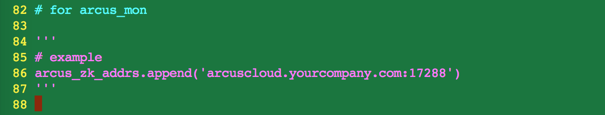

---

   - 수정 후의 코드

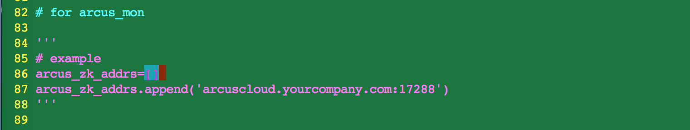

 
----

## 4) official manual의 오탈자 수정

 - Hubblemon
   - 2개의 md 파일에서 오탈자 수정
   - https://github.com/naver/ngrinder/pull/272
 - nBase-ARC
   - 1개의 md 파일에서 오탈자 수정
   - https://github.com/naver/nbase-arc/pull/144

----

